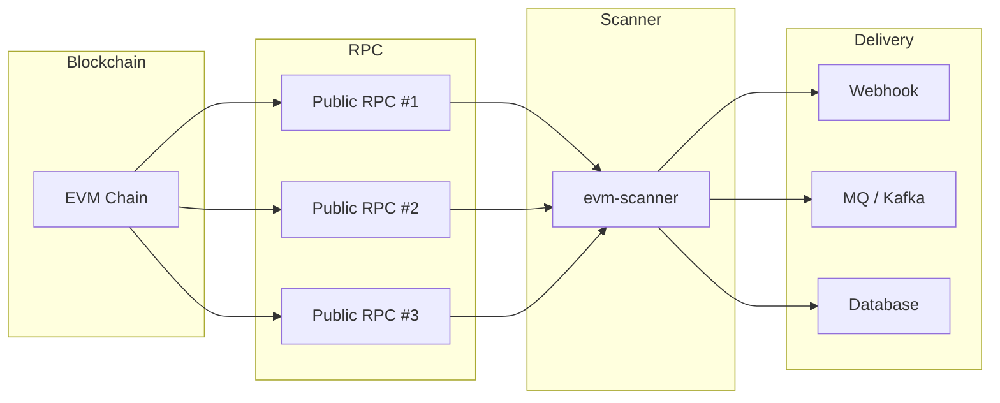

# EVM Scanner 🚀

<p align="center">
  <a href="https://github.com/84hero/evm-scanner/actions/workflows/test.yml">
    
  </a>
  <a href="https://goreportcard.com/report/github.com/84hero/evm-scanner">
    
  </a>
  <a href="https://pkg.go.dev/github.com/84hero/evm-scanner">
    
  </a>
  <a href="https://github.com/84hero/evm-scanner/releases">
    
  </a>
  <a href="https://github.com/84hero/evm-scanner/blob/master/LICENSE">
    
  </a>
</p>

**[English](README.md)** | **[简体中文](README_CN.md)**

A node-less, production-ready EVM blockchain scanner written in Go.  
Reliable event & transaction ingestion via multi-RPC load balancing, failover, and extensible sinks (Postgres, Redis, Kafka, Webhooks).

**Designed for event-driven Web3 backends.** Focuses on **what happened on-chain**, not global state reconstruction.

[Features](#-features) • [Architecture](#-architecture--design) • [Installation](#-installation) • [Quick Start](#-quick-start) • [Documentation](#-documentation) • [Contributing](#-contributing)

---

## 🌟 Features

-   **🌐 Node-less Architecture**: Works with multiple public RPC endpoints—no private nodes required.
-   **⛓️ Multi-Chain Native**: Optimized for Ethereum, BSC, Polygon, Arbitrum, and any EVM-compatible network.
-   **💾 Pluggable Storage**: Choose your persistence layer—**Memory** (dev), **Redis** (performance), or **PostgreSQL** (durability).
-   **🚀 High Performance**: 
    -   **Batch Processing**: Efficient RPC call batching to minimize latency and costs.
    -   **Bloom Filter Support**: Leverages node-level filtering for massive speed gains.
    -   **Worker Pool**: Parallel output processing (sinks) for high-throughput environments.
-   **🔌 Rich Ecosystem (Sinks)**: Stream data directly to **Webhooks**, **Kafka**, **RabbitMQ**, **Redis**, **PostgreSQL**, or flat files.
-   **🛡️ Production Ready**: 
    -   **Reorg-Tolerant**: Automatic reorg handling with configurable safety windows.
    -   **Multi-RPC Failover**: Load balancing and automatic failover across RPC endpoints.
    -   **Cursor Management**: Reliable progress tracking and resumable scanning.
-   **💎 Human Readable**: Built-in ABI decoding turns raw hex logs into structured JSON data automatically.

---

## 🏗️ Architecture & Design

### Design Philosophy

`evm-scanner` is intentionally designed as an **event scanner**, not a full blockchain indexer.

**Its responsibilities:**
- Sequentially scanning blocks
- Parsing transactions and logs
- Decoding ABI-based events
- Delivering events to downstream systems reliably

**It does NOT do:**
- Balance indexing
- Address history indexing
- State reconstruction
- Wallet or explorer APIs

This strict separation ensures clarity of responsibility, reliability, and predictable behavior in production environments.

---

### High-Level Architecture



---

### Why Balances Are Out of Scope

Balance is **state**, not an event. Correct balance tracking requires:
- Full state indexing
- Internal transaction tracing
- Reorg-aware state reconciliation

`evm-scanner` reports **what happened**, not **global blockchain state**.  
For balance queries, please use multicall / frontend / BFF layers.

---

### Block Finality & Reorg Handling

To ensure reliability without private nodes:
- Multiple public RPC endpoints
- Automatic failover and retry
- Confirmation-based scanning
- Only finalized blocks are processed

This makes the scanner resilient to temporary RPC inconsistencies and short reorgs.

---

### Why Public RPCs Are Enough

`evm-scanner` does **not** require private or archive nodes. It only consumes finalized block data and logs.  
Multiple public RPC endpoints are sufficient for production-grade event scanning in most scenarios.

---

### Operational Characteristics

- Stateless scanning logic
- Horizontal scalability
- Low infrastructure cost
- No node maintenance
- Clear failure boundaries

The scanner can be restarted, redeployed, or horizontally scaled without complex state recovery.

---

### Summary

> **`evm-scanner` answers:**  
> "What happened on-chain?"

> **It deliberately does not answer:**  
> "What is the global blockchain state right now?"

This design choice keeps the project lightweight, reliable, and production-friendly.

---

## 💡 Use Cases

- Payment & deposit monitoring
- Webhook notifications
- Event-driven backends
- DeFi / GameFi triggers
- Data pipelines (Kafka / MQ)

---

## 📦 Installation

### Binary (Recommended)
Download the pre-compiled binary for your architecture from the [Releases](https://github.com/84hero/evm-scanner/releases) page.

### Using Go
```bash
go install github.com/84hero/evm-scanner/cmd/scanner-cli@latest
```

### From Source
```bash
git clone https://github.com/84hero/evm-scanner.git
cd evm-scanner
make build
```

## 🚀 Quick Start

### 1. Initialize Configuration
```bash
cp config.yaml.example config.yaml
cp app.yaml.example app.yaml
```

### 2. Run the CLI
```bash
# Start scanning based on app.yaml filters
./bin/scanner-cli
```

### 3. Docker (One-Liner)
```bash
docker-compose up -d
```

## 📖 Documentation

Check out the detailed documentation for configuration and usage depth:

- [**Quick Start**](./docs/en/quick-start.md) - Get your first scanner running in 5 minutes.
- [**Configuration**](./docs/en/configuration.md) - Detailed guide for `config.yaml` and `app.yaml`.
- [**Architecture**](./docs/en/architecture.md) - Understand how EVM Scanner works under the hood.
- [**API Reference**](./docs/en/api-reference.md) - Webhook formats, CLI flags, and Database schema.
- [**Deployment**](./docs/en/deployment.md) - Production best practices and deployment strategies.
- [**Custom Sinks**](./docs/en/custom-sink.md) - Learn how to extend the output destinations.
- [**FAQ**](./docs/en/faq.md) - Frequently asked questions and common troubleshooting.


## 🛠 Usage Examples

### CLI Mode (Standalone)
Define your filters in `app.yaml`:
```yaml
filters:
  - description: "USDT Transfer Tracker"
    contracts: ["0xdAC17F958D2ee523a2206206994597C13D831ec7"]
    topics: ["0xddf252ad1be2c89b69c2b068fc378daa952ba7f163c4a11628f55a4df523b3ef"]
    abi: '[{"anonymous":false,"inputs":[{"indexed":true,"name":"from","type":"address"},...],"name":"Transfer","type":"event"}]'
```

### SDK Mode (As a Library)
Explore our curated examples to see how to integrate `evm-scanner` into your stack:

| Example | Description |
| :--- | :--- |
| [**Basic SDK**](./examples/basic) | Minimal setup to start scanning from a Go app. |
| [**Custom Decoder**](./examples/custom-decoder) | How to decode raw logs into human-readable data using ABIs. |
| [**PostgreSQL Integration**](./examples/postgres-integration) | Production-ready setup using Postgres for both progress tracking and data storage. |
| [**Enterprise MQ**](./examples/enterprise-mq) | Streaming event data to **Kafka** for high-throughput microservices. |
| [**Multi-Sink Pipeline**](./examples/multi-sink) | Dispatching events to Console and Files simultaneously. |
| [**Custom Chain Preset**](./examples/custom-chain) | Configure parameters for a new L2 or AppChain (BlockTime, ReorgSafe). |
| [**Custom Sink**](./examples/custom-sink) | Extend the framework by implementing your own output destination (e.g., Slack). |
| [**Webhook Receiver**](./examples/webhook-receiver) | A simple server to receive and process events via Webhook. |

```go
import (
    "github.com/84hero/evm-scanner/pkg/scanner"
    "github.com/84hero/evm-scanner/pkg/rpc"
)

func main() {
    client, _ := rpc.NewClient(ctx, rpcCfg, 10)
    s := scanner.New(client, storage, scanCfg, filter)
    
    s.SetHandler(func(ctx context.Context, logs []types.Log) error {
        // Your custom business logic here
        return nil
    })
    
    s.Start(ctx)
}
```

## ⚙️ Configuration

The project uses two primary configuration files:
| File | Purpose | Key Settings |
| :--- | :--- | :--- |
| `config.yaml` | Infrastructure | RPC Nodes, DB/Redis connections, Scan speed |
| `app.yaml` | Business Logic | Contracts, Topics, ABI, Output Destinations |

## 🏗 Supported Sinks (Outputs)

| Sink | Status | Use Case |
| :--- | :--- | :--- |
| **Webhook** | ✅ | Real-time API integration |
| **PostgreSQL** | ✅ | Permanent event storage & querying |
| **Redis** | ✅ | Fast message passing (List/PubSub) |
| **Kafka** | ✅ | Big data pipelines & stream processing |
| **RabbitMQ** | ✅ | Enterprise message queuing |
| **Console/File** | ✅ | Debugging and logging |

## 🛠 Development

We use `Makefile` for common tasks:
- `make test`: Run the test suite.
- `make lint`: Run code quality checks.
- `make snapshot`: Local build validation with GoReleaser.

## 🤝 Contributing

Contributions are what make the open source community such an amazing place to learn, inspire, and create. Any contributions you make are **greatly appreciated**.

1. Fork the Project
2. Create your Feature Branch (`git checkout -b feature/AmazingFeature`)
3. Commit your Changes (`git commit -m 'Add some AmazingFeature'`)
4. Push to the Branch (`git push origin feature/AmazingFeature`)
5. Open a Pull Request

## 📧 Contact

- **Telegram**: [@xNew4](https://t.me/xNew4)
- **X (Twitter)**: [@0xNew4](https://x.com/0xNew4)

## 📄 License

Distributed under the MIT License. See `LICENSE` for more information.

---

## 📚 References & Links

- [Ethereum JSON-RPC Documentation](https://ethereum.org/en/developers/docs/apis/json-rpc/)
- [Go Ethereum SDK](https://pkg.go.dev/github.com/ethereum/go-ethereum)
- [Multicall3 Contract](https://github.com/makerdao/multicall)
- [evm-scanner GitHub Repository](https://github.com/84hero/evm-scanner)

---
Built with ❤️ for the Web3 Community.