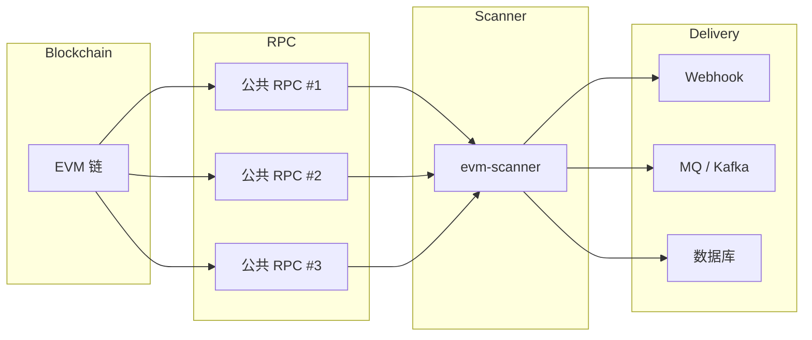

# EVM Scanner 🚀

<p align="center">
  <a href="https://github.com/84hero/evm-scanner/actions/workflows/test.yml">
    
  </a>
  <a href="https://goreportcard.com/report/github.com/84hero/evm-scanner">
    
  </a>
  <a href="https://pkg.go.dev/github.com/84hero/evm-scanner">
    
  </a>
  <a href="https://github.com/84hero/evm-scanner/releases">
    
  </a>
  <a href="https://github.com/84hero/evm-scanner/blob/master/LICENSE">
    
  </a>
</p>

**[English](README.md)** | **[简体中文](README_CN.md)**

一个无需节点、生产就绪的 EVM 区块链扫描器，使用 Go 编写。  
通过多 RPC 负载均衡、故障转移和可扩展的数据接收器（Postgres、Redis、Kafka、Webhooks）实现可靠的事件和交易采集。

**专为事件驱动的 Web3 后端设计。** 专注于**链上发生了什么**，而非全局状态重建。

[特性](#-特性) • [架构设计](#-架构与设计) • [安装](#-安装) • [快速开始](#-快速开始) • [文档](#-文档) • [示例](#-使用示例) • [贡献](#-贡献)

---

## 🌟 特性

-   **🌐 无节点架构**: 使用多个公共 RPC 端点即可工作——无需私有节点。
-   **⛓️ 原生多链支持**: 针对 Ethereum、BSC、Polygon、Arbitrum 以及任何 EVM 兼容网络进行优化。
-   **💾 可插拔存储**: 选择您的持久化层—— **Memory**（开发）、**Redis**（性能）或 **PostgreSQL**（持久性）。
-   **🚀 高性能**: 
    -   **批量处理**: 高效的 RPC 调用批处理，最小化延迟和成本。
    -   **布隆过滤器支持**: 利用节点级过滤实现大幅速度提升。
    -   **工作池**: 并行输出处理（sinks）适用于高吞吐量环境。
-   **🔌 丰富的生态系统（Sinks）**: 直接将数据流式传输到 **Webhooks**、**Kafka**、**RabbitMQ**、**Redis**、**PostgreSQL** 或平面文件。
-   **🛡️ 生产就绪**: 
    -   **重组容错**: 自动处理链重组，具有可配置的安全窗口。
    -   **多 RPC 故障转移**: RPC 端点间的负载均衡和自动故障转移。
    -   **游标管理**: 可靠的进度跟踪和可恢复扫描。
-   **💎 人类可读**: 内置 ABI 解码，自动将原始十六进制日志转换为结构化 JSON 数据。

---

## 🏗️ 架构与设计

### 设计理念

`evm-scanner` 被有意设计为**事件扫描器**，而非完整的区块链索引器。

**它的职责:**
- 顺序扫描区块
- 解析交易和日志
- 解码基于 ABI 的事件
- 可靠地将事件传递到下游系统

**它不做:**
- 余额索引
- 地址历史索引
- 状态重建
- 钱包或区块浏览器 API

这种严格的职责分离确保了责任清晰、可靠性高，并在生产环境中具有可预测的行为。

---

### 高层架构



---

### 为什么余额不在范围内

余额是**状态**，而非事件。正确的余额跟踪需要:
- 完整的状态索引
- 内部交易追踪
- 重组感知的状态协调

`evm-scanner` 报告**发生了什么**，而非**全局区块链状态**。  
对于余额查询，请使用 multicall / 前端 / BFF 层。

---

### 区块最终性与重组处理

为确保在无私有节点的情况下保持可靠性:
- 多个公共 RPC 端点
- 自动故障转移和重试
- 基于确认的扫描
- 仅处理已最终确定的区块

这使扫描器能够抵御临时的 RPC 不一致和短期重组。

---

### 为什么公共 RPC 就足够了

`evm-scanner` **不**需要私有或归档节点。它仅消费已最终确定的区块数据和日志。  
在大多数场景下，多个公共 RPC 端点足以支持生产级事件扫描。

---

### 运营特性

- 无状态扫描逻辑
- 水平可扩展性
- 低基础设施成本
- 无需节点维护
- 清晰的故障边界

扫描器可以重启、重新部署或水平扩展，无需复杂的状态恢复。

---

### 总结

> **`evm-scanner` 回答:**  
> "链上发生了什么？"

> **它有意不回答:**  
> "当前全局区块链状态是什么？"

这种设计选择使项目保持轻量、可靠和生产友好。

---

## 💡 使用场景

- 支付和充值监控
- Webhook 通知
- 事件驱动后端
- DeFi / GameFi 触发器
- 数据管道（Kafka / MQ）

---

## 📦 安装

### 二进制文件（推荐）
从 [Releases](https://github.com/84hero/evm-scanner/releases) 页面下载适合您架构的预编译二进制文件。

### 使用 Go 安装
```bash
go install github.com/84hero/evm-scanner/cmd/scanner-cli@latest
```

### 从源码构建
```bash
git clone https://github.com/84hero/evm-scanner.git
cd evm-scanner
make build
```

## 🚀 快速开始

### 1. 初始化配置
```bash
# 使用英文配置示例
cp config.yaml.example config.yaml
cp app.yaml.example app.yaml

# 或使用中文配置示例（包含中文注释说明）
cp config.yaml.example.cn config.yaml
cp app.yaml.example.cn app.yaml
```

### 2. 运行 CLI
```bash
# 基于 app.yaml 过滤器开始扫描
./bin/scanner-cli
```

### 3. Docker（一键启动）
```bash
docker-compose up -d
```

## 📖 文档

查看详细文档了解更多配置和使用细节：

- [**快速开始**](./docs/zh-CN/quick-start.md) - 在 5 分钟内启动您的第一个扫描器。
- [**配置指南**](./docs/zh-CN/configuration.md) - 详细的 `config.yaml` 和 `app.yaml` 选项说明。
- [**架构设计**](./docs/zh-CN/architecture.md) - 了解 EVM Scanner 的内部工作流程。
- [**API 参考**](./docs/zh-CN/api-reference.md) - Webhook 格式、CLI 参数及数据库结构。
- [**部署指南**](./docs/zh-CN/deployment.md) - 生产环境部署、监控与优化建议。
- [**自定义 Sink**](./docs/zh-CN/custom-sink.md) - 学习如何通过 Go SDK 扩展输出目标。
- [**常见问题 (FAQ)**](./docs/zh-CN/faq.md) - 遇到问题？先在这里找找答案。


## 🛠 使用示例

### CLI 模式（独立运行）
在 `app.yaml` 中定义您的过滤器：
```yaml
filters:
  - description: "USDT 转账追踪器"
    contracts: ["0xdAC17F958D2ee523a2206206994597C13D831ec7"]
    topics: ["0xddf252ad1be2c89b69c2b068fc378daa952ba7f163c4a11628f55a4df523b3ef"]
    abi: '[{"anonymous":false,"inputs":[{"indexed":true,"name":"from","type":"address"},...],{"name":"Transfer","type":"event"}]'
```

### SDK 模式（作为库使用）
探索我们精心策划的示例，了解如何将 `evm-scanner` 集成到您的技术栈中：

| 示例 | 描述 |
| :--- | :--- |
| [**基础 SDK**](./examples/basic) | 从 Go 应用程序开始扫描的最小设置。 |
| [**自定义解码器**](./examples/custom-decoder) | 如何使用 ABI 将原始日志解码为人类可读数据。 |
| [**PostgreSQL 集成**](./examples/postgres-integration) | 使用 Postgres 进行进度跟踪和数据存储的生产就绪设置。 |
| [**企业消息队列**](./examples/enterprise-mq) | 将事件数据流式传输到 **Kafka** 用于高吞吐量微服务。 |
| [**多 Sink 管道**](./examples/multi-sink) | 同时将事件分发到控制台和文件。 |
| [**自定义链预设**](./examples/custom-chain) | 为新的 L2 或 AppChain 配置参数（BlockTime、ReorgSafe）。 |
| [**自定义 Sink**](./examples/custom-sink) | 通过实现自己的输出目标（例如 Slack）来扩展框架。 |
| [**Webhook 接收器**](./examples/webhook-receiver) | 一个简单的服务器，用于通过 Webhook 接收和处理事件。 |

```go
import (
    "github.com/84hero/evm-scanner/pkg/scanner"
    "github.com/84hero/evm-scanner/pkg/rpc"
)

func main() {
    client, _ := rpc.NewClient(ctx, rpcCfg, 10)
    s := scanner.New(client, storage, scanCfg, filter)
    
    s.SetHandler(func(ctx context.Context, logs []types.Log) error {
        // 在这里编写您的自定义业务逻辑
        return nil
    })
    
    s.Start(ctx)
}
```

## ⚙️ 配置

项目使用两个主要配置文件：
| 文件 | 用途 | 关键设置 |
| :--- | :--- | :--- |
| `config.yaml` | 基础设施 | RPC 节点、数据库/Redis 连接、扫描速度 |
| `app.yaml` | 业务逻辑 | 合约、主题、ABI、输出目标 |

## 🏗 支持的 Sinks（输出）

| Sink | 状态 | 使用场景 |
| :--- | :--- | :--- |
| **Webhook** | ✅ | 实时 API 集成 |
| **PostgreSQL** | ✅ | 永久事件存储和查询 |
| **Redis** | ✅ | 快速消息传递（List/PubSub） |
| **Kafka** | ✅ | 大数据管道和流处理 |
| **RabbitMQ** | ✅ | 企业消息队列 |
| **Console/File** | ✅ | 调试和日志记录 |

## 🛠 开发

我们使用 `Makefile` 来执行常见任务：
- `make test`: 运行测试套件。
- `make lint`: 运行代码质量检查。
- `make snapshot`: 使用 GoReleaser 进行本地构建验证。

## 🤝 贡献

贡献使开源社区成为一个学习、启发和创造的绝佳场所。我们**非常感谢**您做出的任何贡献。

1. Fork 本项目
2. 创建您的特性分支 (`git checkout -b feature/AmazingFeature`)
3. 提交您的更改 (`git commit -m 'Add some AmazingFeature'`)
4. 推送到分支 (`git push origin feature/AmazingFeature`)
5. 开启一个 Pull Request

## 📧 联系方式

- **Telegram**: [@xNew4](https://t.me/xNew4)
- **X (Twitter)**: [@0xNew4](https://x.com/0xNew4)

## 📄 许可证

根据 MIT 许可证分发。有关更多信息，请参阅 `LICENSE`。

---

## 📚 参考资料与链接

- [Ethereum JSON-RPC 文档](https://ethereum.org/en/developers/docs/apis/json-rpc/)
- [Go Ethereum SDK](https://pkg.go.dev/github.com/ethereum/go-ethereum)
- [Multicall3 合约](https://github.com/makerdao/multicall)
- [evm-scanner GitHub 仓库](https://github.com/84hero/evm-scanner)

---
用 ❤️ 为 Web3 社区构建。
